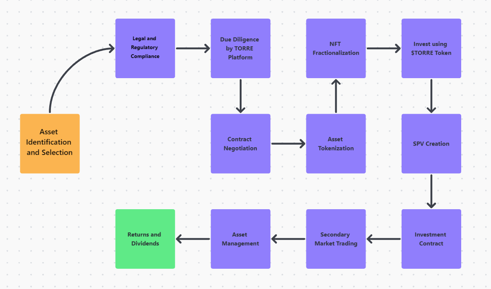

# TORRE Capital Investment

##The future of fractional investment

The world’s most revolutionary real estate investing platform, allowing individuals to incorporate investments into their daily life via Fractional ownership

## Executive Summary

Real estate, as the world's single largest asset class, has traditionally been one of the most popular forms of investment due to its ability to generate revenue through rental yield and potential capital gains that hedge against inflation, as well as being a physical asset class with less volatility than equity markets. Separately, blockchain technology, which powers the highly sought-after cryptocurrencies, has enormous promise for future digitization of real estate investment due to its unique decentralization, transparency, and uncompromising security characteristics.

Torre Capital International provides the best of both worlds to the market by integrating real estate investment with blockchain technology, backed by its unique "Fractional ownership" strategy that revolutionizes real estate investment and ownership, reaching out to more prospective investors from the start. Torre Capital International's objective is to make real estate investing accessible to everyone. Investing in real estate assets used to be restricted to high-net-worth individuals, either because the investor was required to purchase the entire property or due to the minimum initial investment required to invest in a private real estate fund. Furthermore, real estate is notorious for its illiquidity. As a result, Torre Capital International is prepared to decentralize real estate ownership and boost liquidity in the real estate market.

## Technical Design

Detailed process of real estate tokenization, due diligence by the platform, and creation of a special purpose vehicle (SPV) such as a real estate trust or LLC

1. Asset Identification and Selection: The first step will be to identify and select a real estate asset to be tokenized. The asset must meet certain criteria, such as having a clear title, having an established rental history, or being located in a desirable area.

2. Legal and Regulatory Compliance: Before proceeding with the tokenization process, we will conduct a legal and regulatory review to ensure that the asset meets all the necessary legal and regulatory requirements. This review will include checking for compliance with local real estate laws, securities regulations, and tax laws.

3. Due Diligence: Once the legal and regulatory compliance review is complete, we will conduct a thorough due diligence process. The due diligence will include legal, financial, and operational reviews of the asset to ensure that it meets the required standards.

4. Contract Negotiation: The platform will negotiate and draft a contract with the seller of the real estate asset, which will detail the terms of the sale and the rights and responsibilities of each party. The contract will also specify the process for transferring ownership of the asset to the SPV and the creation of the NFT representing ownership in the property.

5. Asset Tokenization: After the contract has been finalized, the asset will be tokenized by creating a digital asset, typically an NFT, representing ownership in the property. The NFT will be registered on the blockchain along with the property title. 

6. NFT Fractionalization: The NFT will then be divided into smaller portions or fractions, which are called wrapped NFTs. Each wrapped NFT represents a specific fraction of the property's total value, which can be as small as 1/10,000th of the value or larger depending on how the property is divided. These shares will be represented by wrapped NFTs, each with a unique custom token name, such as "TDUB001234, TLND934987 or THGK737654". The value of each wrapped NFT is directly tied to the price of the property, with the value of each share depending on the total value of the property and the number of shares it is divided into. For example, a $1,000,000 property divided into 1,000 shares means each wrapped NFT represents a share worth $1,000, while the same property divided into 10,000 shares would mean each wrapped NFT represents a share worth $100. Investors can purchase wrapped NFTs representing a fraction of the property they want to invest in, which they can then trade or hold as an investment. Additionally, Wrapped NFTs provide liquidity to investors and allow for easy trading on our Platform. This means investors can quickly and easily buy or sell their shares.

7. Invest using $TORRE Token: Investors would then be able to use their $TORRE Tokens to invest in the wrapped NFT representing ownership in the property. To purchase the wrapped NFT, investors will need to use our $TORRE Token, which is our platform utility token ($TORRE).

8. SPV Creation: A Special Purpose Vehicle (SPV) will be created to hold the real estate asset on behalf of the investors. The SPV can be structured as a real estate trust or LLC, which will be managed by a professional management company.

9. Investment Contract: A legally binding investment contract will be drawn up, which outlines the terms and conditions of the investment. This contract will detail the investment amount, the ownership percentage of the property, and the expected returns.

10. Secondary Market Trading: After the completion of the investment, the NFT representing the ownership in the property can be traded on the secondary market. This will enable investors to liquidate their investments or trade them with other investors.

11. Asset Management: The management company will handle the day-to-day operations of the asset, including property maintenance, rent collection, and accounting. They will also ensure that the property is in compliance with local regulations and requirements.

12. Returns and Dividends: The returns and dividends from the real estate asset will be distributed to the investors as per the terms of the investment contract.

## Whitepaper

[Link to whitepaper](https://whitepaper.torreci.com/whitepaper/executive-summary)

## Tokenomics

[Link to tokenomics](https://whitepaper.torreci.com/whitepaper/the-tokenomics)

